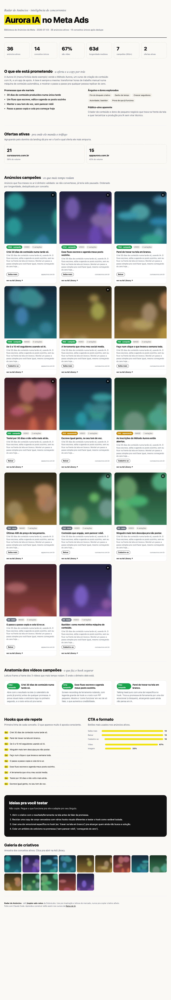

# 🕵️ Espiar Ads (Ratos de IA)

Uma skill de Claude Code que espiona os anúncios que qualquer concorrente está rodando no **Meta Ads** (Facebook e Instagram), direto da Biblioteca de Anúncios da Meta, e monta um **relatório HTML** com os padrões que estão funcionando: copy, criativo, oferta, hooks e uma análise dos vídeos campeões feita com IA.

Você conversa com o Claude, fala qual concorrente quer espiar, e ele puxa tudo, deduplica, baixa os criativos, assiste os vídeos e te entrega um relatório pronto pra tirar ideia de criativo novo.



> O exemplo acima usa uma marca fictícia (Aurora IA) e criativos borrados, só pra ilustrar o formato.

## O que ela faz

- **Espia por conta**: dá o @ do Instagram ou o nome da página e ela acha os anúncios ativos
- **Espia por nicho**: dá uma palavra-chave e ela revela quem são os anunciantes daquele mercado
- **Deduplica por conceito**: 166 anúncios viram os ~30 conceitos reais (agrupa as variações)
- **Ordena por longevidade**: destaca os campeões (anúncio que roda há meses é dinheiro validado)
- **Enxerga o criativo**: baixa imagens e vídeos e o Claude analisa o hook frame a frame, não só a legenda
- **Mapeia a oferta**: agrupa pelas landing pages pra mostrar o funil do concorrente
- **Sintetiza a copy**: resume o que ele promete, os ângulos que explora e te dá ideias adaptáveis
- **Relatório HTML** navegável com identidade visual, pronto pra compartilhar

## Como funciona por baixo

Usa a API da [ScrapeCreators](https://scrapecreators.com), que lê a Biblioteca de Anúncios pública da Meta. Tem **free tier de 1.000 créditos** (sem cartão). Cada página de anúncios custa ~1 crédito (~10 anúncios), então dá pra espiar dezenas de concorrentes de graça pra aprender.

Zero dependências além de `python3`. A análise de vídeo usa `ffmpeg` (opcional).

## Instalação

1. Copie a pasta pra `~/.claude/skills/espiar-ads-ratos/`
2. Abra o Claude Code e rode `/espiar-ads-ratos`
3. Na primeira vez, o Claude te guia: cria conta na ScrapeCreators, pega a chave, e pronto

Ou clone direto:
```bash
# baixe o zip de espiar-ads-ratos na plataforma (Materiais) e descompacte em ~/.claude/skills/
```

## Uso

É só conversar:

> "Espia os anúncios do @perfil_do_concorrente no Meta"

> "Quem tá anunciando no nicho de 'curso de inglês' no Brasil?"

> "Analisa os criativos dessa página: [link da Ad Library]"

O Claude resolve a conta, puxa os anúncios, analisa e te entrega o relatório.

## Ética

Isso é ferramenta de **inteligência competitiva e inspiração**, não de plágio. Use os padrões pra entender o mercado e criar o SEU criativo, com o SEU ângulo. Nunca copie copy ou arte de ninguém.

---

## Feito com Claude Code, nos cursos da Ratos de IA

Essa skill nasceu dentro do universo da **[Ratos de IA](https://ratosdeia.com.br)**, a escola de IA aplicada da DobraLabs. Se você quer aprender a construir skills e automações assim (do zero, mesmo sem ser programador), é lá:

- **Claude Code OS** — monte seu sistema operacional de trabalho com IA no Claude Code
- **Generalista de IA** — do "usar" ao "construir" com IA
- **Comunidade Ratos de IA** — todos os cursos + fórum + suporte

👉 **[ratosdeia.com.br](https://ratosdeia.com.br)**

Feito pela [DobraLabs](https://dobralabs.com.br). 🐀
